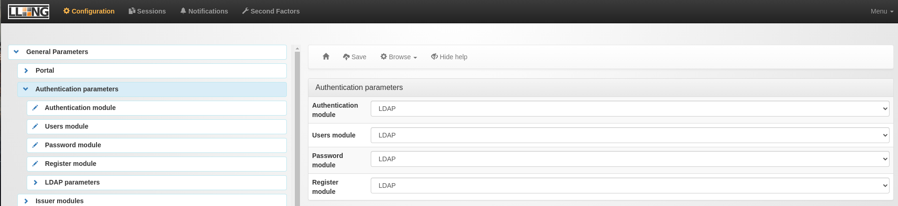

# Local deployment for development

## SMS API
we are using octopush API to send OTP messages.

create an account [here](https://client.octopush.com/en/registration) and login, then grab your `api-key` and `api-login` from the [OTP setting page](https://client.octopush.com/settings/otp).

upon registration you have 5€ free credits.

## Environment variables:

create a `.env` file at the root of the project with the following variables:

```sh
SMS_SERVICE_KEY=your api-key from octupush
SMS_SERVICE_LOGIN=your api-login from octupush
SMS_SERVICE_API=https://api.octopush.com/v1/public/service/otp
SECRET="some complex secret string with 32 chars long"
LDAP_URL=your ldap service
LDAP_BASE=the ldap base DN
LDAP_DN=the ldap admin DN
LDAP_ADMIN_PASSWORD=the ldap password
AUTH_URL=your lemonldap auth url
```
example env:

```bash
SMS_SERVICE_KEY=redacted
SMS_SERVICE_LOGIN=email@example.com
SMS_SERVICE_API=https://api.octopush.com/v1/public/service/otp
SECRET="p1TM]e7@wy]xcQ=G?RiPe.95og^3@)>F"
LDAP_URL="ldap://localhost:1389"
LDAP_BASE="dc=example,dc=org"
LDAP_DN="cn=admin,dc=example,dc=org"
LDAP_ADMIN_PASSWORD=123456
AUTH_URL="http://auth.example.com"
```

## run the serivices using docker

the project uses `lemonldap-ng-full` and `ldap`.

### configure the lemonldap domains locally:

add the following to the `/etc/hosts` file:

```bash
127.0.0.1	auth.example.com manager.example.com
```

### pull the images:

```sh
docker-compose pull
```

### run the containers:

```sh
docker-compose up -d
```

### the service ports

- `ldap`: 1389
- `lemonldap-ng-full`: 80

## Configure lemonldap

we need to configure lemonldap to use our LDAP service for authentication.

- navigate to http://auth.example.com/ and login using the default admin credentials (dwho:dwho)

- on the right side navigate to `General Parameters` > `Authentication parameters`.

- set all the Authentication parameters to LDAP



- on the right side navigate to `General Parameters` > `Authentication parameters` > `LDAP parameters` > `Connection`

- fill in the LDAP service information:
 
`Server host`: is the LDAP docker container IP, you can retreive this using:

```sh
docker inspect -f '{{range.NetworkSettings.Networks}}{{.IPAddress}}{{end}}' twake-matrix-register_openldap_1
```

`twake-matrix-register_openldap_1` is an example of the ldap docker container name. for example the IP would be `172.18.0.3`

`server port`: 1389

`Verify LDAP server certificate`: None

`Users search base`: `dc=example,dc=org`

`account`: the admin DN, by default `cn=admin,dc=example,dc=org`

`password`: 123456

- save

now you should be able to use the LDAP service for login.

( note that you can't login anymore with dwho)
